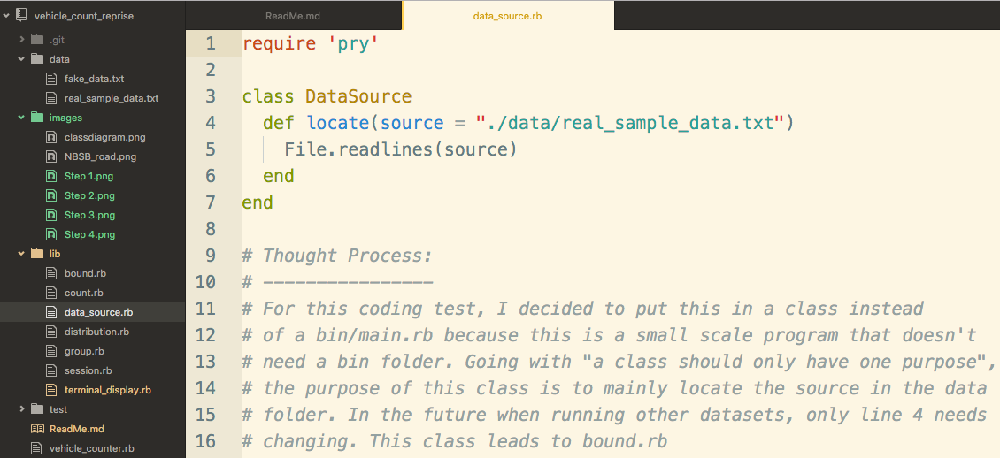

# Vehicle Counter
---
## Understanding the Problem
A small city government recently installed pneumatic sensors that counts passing vehicles across two traffic lanes.

The first pneumatic rubber hose (sensor A) stretches across both lanes of traffic (North and South Bound) while the second (sensor B), on one lane (South Bound). The sensors were left to run for 5 days in a row.

### Reading the data in AA / AB format
From the raw data provided, a line consist of two parts; the sensor (A or B) and the time from midnight of the a particular day (out of five days) in mili-seconds.

- A98186
- A98333
- A499718
- A499886
- A638379
- B638382
- A638520
- B638523

Take for example a fraction of the raw data here, the first two lines indicate a vehicle's first axle passing through sensor A (North Bound) 98.186 seconds past midnight. The second line which follows shortly after, at 98.333s, is the second axle of the same vehicle. When converted to a more familiar time format (hour:minute:second), both axles were recorded at 00:01:38, with just a slight difference in mili-seconds (0.147ms). All vehicles passing through sensor A would have an AA format in two consecutive lines.

Since Sensor A stretches across both lanes and Sensor B only on one lane, vehicles travelling on the South Bound would be recorded with an ABAB format in four lines. Hence, line 5 to 8 indicate one vehicle travelling down . The first axle occurred at B638382 while the second at B638523, 10 minutes and 38 seconds pass midnight with a few mili-seconds apart.

- A86328771
- B86328774
- A86328899
- B86328902
- A582668
- B582671
- A582787
- B582789

When the length of the miliseconds drop as such, its an indication of a new day as the data is only recorded from midnight.

### Objectives/Requirements
The city has asked for the data to be processed in order to obtain the following requirements for all five days across both lanes.

__Vehicle Count__

North Bound (AA Sensor) | South Bound (AB Sensor) | Limitation
 --- | --- | --- |
per hour                | per hour                | 5 days     
per 30min               | per 30min               | 5 days     
per 20min               | per 20min               | 5 days     
per 15min               | per 15min               | 5 days     
peaks - 3 peaks/day     | peaks - 3 peaks/day     | 5 days     
Morning VS Evening      | Morning VS Evening      | 5 days     

__Vehicle Distribution__                       

North Bound (AA Sensor)  | South Bound (AB Sensor) | Limitation
 --- | --- |---
 speed range/ average    | speed range/ average    | 5 days     
 distance user's choice  | distance user's choice  | 5 days    

  **Essential Information**
  1. Only 2-axle vehicles are allowed on these lanes. The average wheelbase of the vehicles passing through both lanes are 2.5meters between axles. This information is crucial to determine the rough speed distribution of the cars.

  vehicle velocity (m/s) = distance between two axles (m) / time between two axles (s)

  2. The speed limit on the road is 60kph. However, this does not mean that everyone drives at this speed. From this piece of information, the rough distance between cars can be obtained from the following formula.

  rough distance (m) =  traffic speed (m/s) * time in between cars (s)

## Approach

It was challenging to solve this problem with an object oriented design approach when dealing with such a large quantity of raw data. There was the option to treat each entry (in pairs) as an object. However, it would be difficult to achieve the requirements stated above as the displays would be across 5 days on both lanes. As a result, I decided to treat the hashes and arrays as objects instead. These hashes and arrays contain the processed data from the Classes and their functions, each with its own purpose. Below is the class diagram break down and flow.

__first stage:__
  * data_source.rb reads the source
  * bound splits.rb data to north and south bound - AA or ABAB pattern
  * group splits.rb north & south bound into pairs - processed in pairs

__second stage:__
  * session.rb allow vehicle counts to be displayed in 60mins , 30mins, 20mins and 15mins periods
  * distribution.rb determines speed and distance apart - grouped together for similar design
  * count.rb to determine peaks and compare mornings to evenings - grouped together for similar design

__final stage:__
  * terminal display displays the processed data in universal format - per day

## Solutions

Please refer into the individual class files located in the lib file for the though process.

## How to use?

In the main directory, run "ruby vehicle_counter.rb" in the command line. Follow the options provided.

The main menu lets users choose the bound you wish to be processed. After selecting one, a second menu follows. Users can now choose to view the vehicle counts in specific time frames, compare vehicle counts between morning and evening, determine the speed and distance distribution of the traffic.

Users can hit 'q' to quit. With Option number (8), Rough distance distribution **across various periods** are grouped per hour. Therefore, the when prompted to provide 'from hour' and 'to hour', users should provide 15 to 23 if they wish to view traffic distribution between 3pm to 12am.

Lastly, if the user would like to process a new data set with a similar structure, all they need to do is to include the data set in the /data directory and change the path specified in data_source.rb (Line 4)

